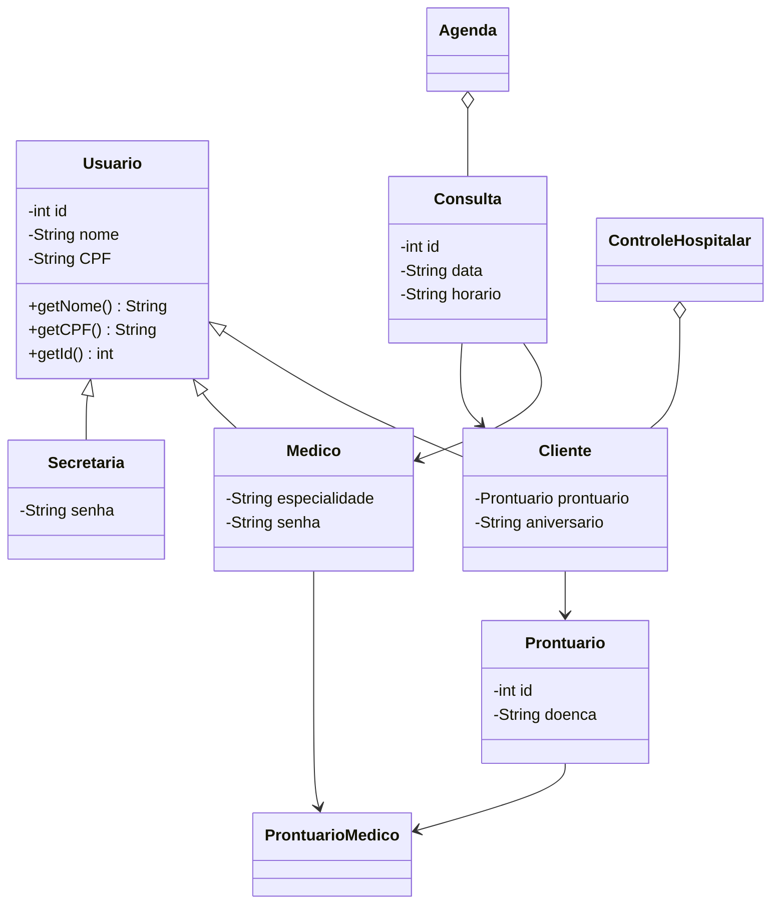

# Sistema de Agendamento Médico

Back-end em Java para um sistema de agendamento médico, desenvolvido como projeto da disciplina de Programação Orientada a Objetos (Grupo 8).

O sistema modela o fluxo de um consultório/hospital: cadastro de clientes, médicos e secretárias, agendamento de consultas e manutenção de prontuários médicos, com persistência em banco de dados local via ORM.

## Sumário

* [Arquitetura](#arquitetura)
* [Modelo de dados e diagrama de classes](#modelo-de-dados-e-diagrama-de-classes)
* [Estrutura do projeto](#estrutura-do-projeto)
* [Pré-requisitos](#pré-requisitos)
* [Como executar](#como-executar)
* [Exemplos de uso](#exemplos-de-uso)
* [Decisões de projeto](#decisões-de-projeto)

## Arquitetura

O projeto segue uma separação em camadas:

* **Entidades (`model`)** — classes que representam o domínio (`Usuario`, `Cliente`, `Medico`, `Secretaria`, `Prontuario`, `Consulta`, `ProntuarioMedico`), mapeadas para tabelas via anotações do **ORMLite**.
* **Repositórios (`*Repository`)** — camada de acesso a dados (padrão DAO/Repository) que isola a persistência da lógica de negócio. Cada entidade principal possui seu repositório dedicado, responsável pelas operações de CRUD.
* **Serviços de domínio** — `Agenda` controla o agendamento e a visualização de consultas por médico; `ControleHospitalar` gerencia o cadastro de clientes e o acesso aos prontuários.
* **Persistência** — banco de dados relacional local **SQLite**, acessado via **ORMLite**, responsável pelo mapeamento objeto-relacional.

---

## Modelo de dados e diagrama de classes



> O GitHub renderiza automaticamente diagramas Mermaid na página do repositório.

---

## Usuario (Classe Base)

Classe responsável pelos atributos comuns aos usuários do sistema.

| Campo | Tipo   |
| ----- | ------ |
| id    | int    |
| nome  | String |
| CPF   | String |

As classes `Cliente`, `Medico` e `Secretaria` herdam seus atributos e comportamentos.

---

## Database

Classe responsável pela conexão com o banco SQLite utilizando ORMLite.

Exemplo:

```java
Database database = new Database("hospital.db");
```

Principais métodos:

* `getConnection()`
* `close()`

---

## Relacionamentos

| Relação              | Tipo    |
| -------------------- | ------- |
| Usuario → Cliente    | Herança |
| Usuario → Medico     | Herança |
| Usuario → Secretaria | Herança |
| Cliente → Prontuario | 1:1     |
| Prontuario ↔ Medico  | N:N     |
| Consulta → Medico    | N:1     |
| Consulta → Cliente   | N:1     |

---

## Estrutura do Projeto

```text
g8/
├── pom.xml
├── README.md
├── Plano_de_Testes_Inicial.md
└── src/
    └── main/
        └── java/
            └── com/poo/
                ├── Usuario.java
                ├── Cliente.java
                ├── Medico.java
                ├── Secretaria.java
                ├── Prontuario.java
                ├── ProntuarioMedico.java
                ├── Consulta.java
                ├── Agenda.java
                ├── ControleHospitalar.java
                ├── Database.java
                ├── ClienteRepository.java
                ├── MedicoRepository.java
                ├── SecretariaRepository.java
                ├── ProntuarioRepository.java
                └── ConsultaRepository.java
```

---

## Pré-requisitos

* Java JDK 17+
* Maven
* SQLite (gerado automaticamente pelo ORMLite)

---

## Como executar

```bash
git clone https://github.com/poo-ec-2026-1/g8.git

cd g8

mvn compile

mvn exec:java -Dexec.mainClass="com.poo.Main"
```

> Caso a classe principal possua outro nome, altere `com.poo.Main` para a classe correta.

---

## Exemplos de Uso

### Cadastro de Cliente

```java
Database database = new Database("hospital.db");

ProntuarioRepository prontuarioRepo = new ProntuarioRepository(database);
ClienteRepository clienteRepo = new ClienteRepository(database);

Prontuario prontuario = prontuarioRepo.create(new Prontuario("Hipertensão"));

Cliente cliente = new Cliente(
    "Maria Silva",
    "123.456.789-00",
    0,
    prontuario,
    "1990-05-12"
);

clienteRepo.create(cliente);
```

### Agendamento de Consulta

```java
Database database = new Database("hospital.db");

MedicoRepository medicoRepo = new MedicoRepository(database);
ConsultaRepository consultaRepo = new ConsultaRepository(database);

Medico medico = new Medico(
    "João Souza",
    "987.654.321-00",
    "Cardiologia",
    "senha123"
);

medicoRepo.create(medico);

Consulta consulta = new Consulta(
    0,
    "2026-07-10",
    "14:30",
    medico,
    cliente
);

consultaRepo.create(consulta);

Agenda agenda = new Agenda(new ArrayList<>());

agenda.novaConsulta(consulta);
agenda.exibirAgenda(medico, "senha123");
```

### Consulta ao Prontuário

```java
ControleHospitalar controle =
    new ControleHospitalar(new ArrayList<>());

controle.cadastrarCliente(cliente);

controle.verProntuario(
    "senha123",
    "123.456.789-00"
);
```

---

## Decisões de Projeto

* Utilização do padrão **Repository/DAO** para separar persistência e regras de negócio.
* Persistência utilizando **ORMLite + SQLite**, reduzindo a necessidade de SQL manual.
* Relacionamento muitos-para-muitos implementado por meio da entidade associativa `ProntuarioMedico`.
* Organização do projeto seguindo princípios de orientação a objetos e separação em camadas.

---

## Histórico do Projeto

O desenvolvimento foi iniciado no **BlueJ** e posteriormente migrado para o **Visual Studio Code**, facilitando o desenvolvimento colaborativo, a integração com Git/GitHub e o uso do Maven para gerenciamento do projeto.
