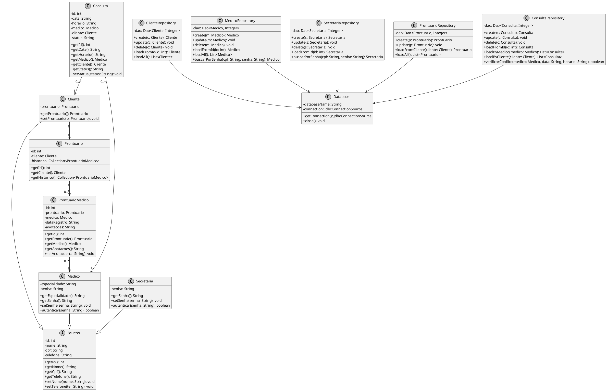
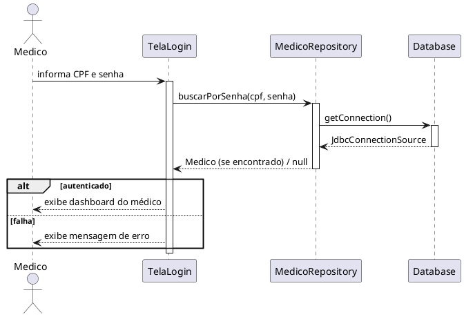
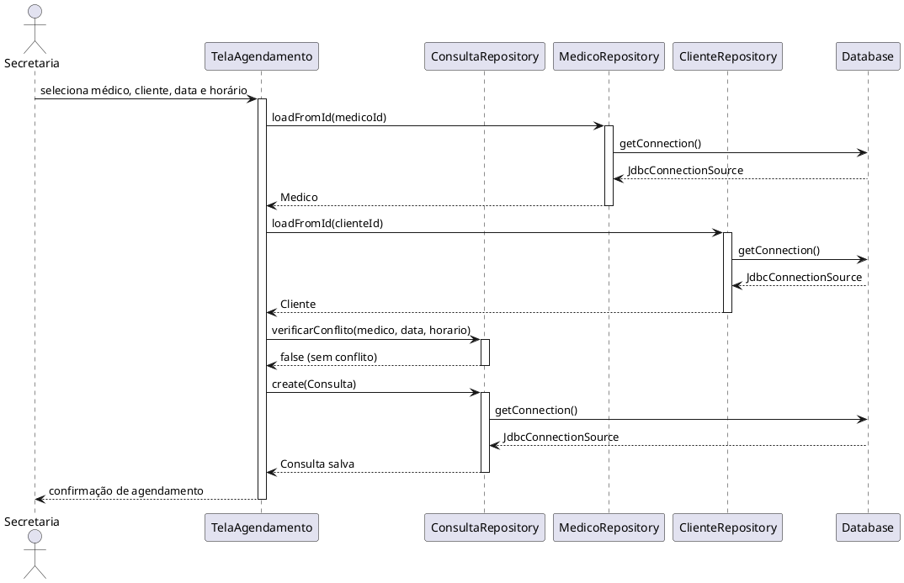
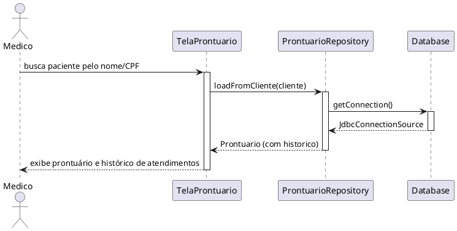
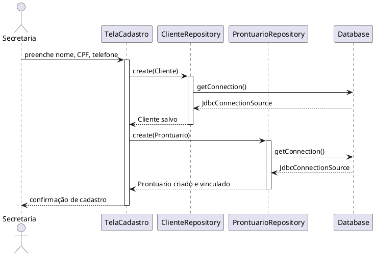
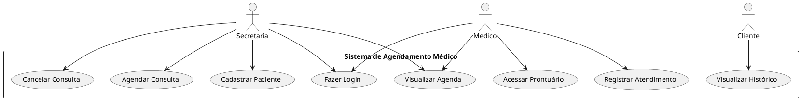

# Sistema de Agendamento Médico — Grupo 8

Repositório do Grupo 8 da disciplina de **Programação Orientada a Objetos (2026/1)**.

---

## 👥 Membros da Equipe

| Nome | Função |
|---|---|---|
| Alberto Tomaz | Líder do Projeto |
| Gabriel Fonseca | Backend |
| Gabriel Mendes | Frontend |
| Mateus Augusto | Testes |
| Isabela Campos | Documentação |

---

## Seção 1 — Introdução

### Justificativa

A gestão de clínicas médicas, especialmente em saúde mental, envolve processos sensíveis e complexos: agendamentos, controle de prontuários, histórico de atendimentos e comunicação entre médicos e secretaria. A ausência de um sistema digital bem estruturado força profissionais a depender de anotações manuais ou ferramentas genéricas que não atendem às especificidades da área.

### Descrição do Problema

Um dos integrantes do grupo possui um familiar que trabalha em uma clínica psiquiátrica e identificou, na prática, a deficiência de um sistema eficiente e eficaz que atenda a tudo que um médico precisa: desde o agendamento de consultas até a organização e o acesso a prontuários eletrônicos completos do paciente.

### Motivação

A proposta deste projeto é desenvolver um sistema de agendamento médico e gestão de prontuários eletrônicos utilizando os princípios da Programação Orientada a Objetos. O objetivo é oferecer uma solução acessível, modular e confiável para clínicas, com foco em saúde mental, que facilite o dia a dia de médicos, secretárias e pacientes.

---

## Seção 2 — Plano

### Objetivo Geral

Desenvolver um sistema back-end em Java para agendamento de consultas médicas e organização de prontuários eletrônicos, utilizando programação orientada a objetos, persistência em banco de dados relacional e boas práticas de arquitetura de software.

### Objetivos Específicos

- Implementar cadastro de clientes (pacientes), médicos e secretárias com autenticação.
- Desenvolver a lógica de agendamento de consultas, impedindo conflitos de horário.
- Criar e manter prontuários eletrônicos por paciente, com histórico de atendimentos.
- Aplicar herança e polimorfismo para representar os diferentes perfis de usuários do sistema.
- Persistir os dados em banco SQLite via ORMLite, com operações CRUD para cada entidade.
- Documentar o sistema com diagramas UML (classes, sequência e casos de uso).

---

## Seção 3 — Divisão de Tarefas

| Membro | Responsabilidades |
|---|---|
| Alberto Tomaz | Coordenação geral, integração dos módulos, revisão de arquitetura |
| Gabriel Fonseca | Implementação das classes de modelo, repositórios e lógica de negócio |
| Gabriel Mendes | Desenvolvimento da interface do usuário (frontend/JavaFX) |
| Mateus Augusto | Plano de testes, casos de teste e validação das funcionalidades |
| Isabela Campos | Documentação, diagramas UML, README e relatórios |

---

## Seção 4 — Modelagem

### 4.1 Diagrama de Classes



---

### 4.2 Diagramas de Sequência

#### Fazer Login (Médico)



---

#### Agendar Consulta (Secretaria)



---

#### Acessar Prontuário



---

#### Cadastrar Cliente (Paciente)



---

### 4.3 Diagrama de Casos de Uso



---

### 4.4 Casos de Uso Detalhados

#### Fazer Login

| Campo | Descrição |
|---|---|
| **Nome** | fazerLogin |
| **Atores** | Médico, Secretaria |
| **Descrição** | O usuário acessa o sistema informando CPF e senha. |
| **Pré-condições** | O usuário possui cadastro ativo no sistema. |
| **Pós-condições** | O usuário é autenticado e redirecionado ao seu dashboard. |
| **Fluxo Principal** | 1. O usuário informa CPF e senha. 2. O sistema consulta o repositório correspondente. 3. As credenciais são validadas. 4. O sistema exibe o dashboard do usuário. |
| **Alternativas** | 3a. Se as credenciais forem inválidas, o sistema exibe mensagem de erro e solicita nova tentativa. |

---

#### Cadastrar Paciente

| Campo | Descrição |
|---|---|
| **Nome** | cadastrarPaciente |
| **Ator** | Secretaria |
| **Descrição** | A secretaria cadastra um novo paciente no sistema e um prontuário é criado automaticamente. |
| **Pré-condições** | A secretaria está autenticada. |
| **Pós-condições** | O paciente é salvo no banco e um prontuário vazio é vinculado a ele. |
| **Fluxo Principal** | 1. A secretaria preenche nome, CPF e telefone. 2. O sistema valida os dados. 3. Um registro de `Cliente` é criado. 4. Um `Prontuario` é automaticamente criado e vinculado ao cliente. 5. O sistema confirma o cadastro. |
| **Alternativas** | 2a. Se o CPF já estiver cadastrado, o sistema informa o conflito e cancela a operação. |

---

#### Agendar Consulta

| Campo | Descrição |
|---|---|
| **Nome** | agendarConsulta |
| **Ator** | Secretaria |
| **Descrição** | A secretaria agenda uma consulta vinculando médico, paciente, data e horário. |
| **Pré-condições** | A secretaria está autenticada; médico e paciente existem no sistema. |
| **Pós-condições** | A consulta é salva com status "Agendada". |
| **Fluxo Principal** | 1. A secretaria seleciona o médico, o paciente, a data e o horário. 2. O sistema verifica conflito de horário para o médico. 3. Não havendo conflito, a consulta é criada e salva. 4. O sistema confirma o agendamento. |
| **Alternativas** | 2a. Se houver conflito de horário, o sistema informa e solicita novo horário. |

---

#### Cancelar Consulta

| Campo | Descrição |
|---|---|
| **Nome** | cancelarConsulta |
| **Ator** | Secretaria |
| **Descrição** | A secretaria cancela uma consulta previamente agendada. |
| **Pré-condições** | A consulta existe e está com status "Agendada". |
| **Pós-condições** | O status da consulta é alterado para "Cancelada" e o horário fica disponível. |
| **Fluxo Principal** | 1. A secretaria localiza a consulta. 2. Confirma o cancelamento. 3. O sistema atualiza o status para "Cancelada". 4. O sistema confirma a operação. |
| **Alternativas** | 1a. Se a consulta não for encontrada, o sistema informa o erro. |

---

#### Acessar Prontuário

| Campo | Descrição |
|---|---|
| **Nome** | acessarProntuario |
| **Ator** | Médico |
| **Descrição** | O médico consulta o prontuário eletrônico de um paciente, incluindo histórico de atendimentos. |
| **Pré-condições** | O médico está autenticado; o paciente possui prontuário cadastrado. |
| **Pós-condições** | O prontuário e o histórico de atendimentos são exibidos. |
| **Fluxo Principal** | 1. O médico busca o paciente por nome ou CPF. 2. O sistema carrega o prontuário vinculado. 3. O histórico de atendimentos (`ProntuarioMedico`) é exibido em ordem cronológica. |
| **Alternativas** | 1a. Se o paciente não for encontrado, o sistema informa que não há registro. |

---

#### Registrar Atendimento

| Campo | Descrição |
|---|---|
| **Nome** | registrarAtendimento |
| **Ator** | Médico |
| **Descrição** | Após a consulta, o médico registra anotações clínicas no prontuário do paciente. |
| **Pré-condições** | O médico está autenticado e acessou o prontuário do paciente. |
| **Pós-condições** | Um novo registro de `ProntuarioMedico` é adicionado ao histórico do paciente. |
| **Fluxo Principal** | 1. O médico acessa o prontuário do paciente. 2. Insere as anotações do atendimento. 3. O sistema cria um `ProntuarioMedico` com data, médico e anotações. 4. O sistema confirma o registro. |
| **Alternativas** | 2a. Se o campo de anotações estiver vazio, o sistema solicita preenchimento antes de salvar. |

---

## Seção 5 — Arquitetura e Padrões de Projeto

Para garantir que o sistema seja modular, escalável e de fácil manutenção, foram adotados os seguintes padrões:

- **OOP / Herança e Polimorfismo:** `Usuario` é uma classe abstrata mãe. `Cliente`, `Medico` e `Secretaria` a estendem com comportamentos específicos.
- **Data Access Object (DAO) / Repository:** Camada de persistência isolada da lógica de negócio. Cada entidade possui seu repositório dedicado com operações CRUD.
- **ORM com ORMLite:** Mapeamento objeto-relacional automatizado, lendo metadados das classes Java para criar e gerenciar as tabelas no banco.

### Relacionamentos de Banco de Dados

- **Many-to-One:** `Consulta` possui chave estrangeira para `Medico` e `Cliente`.
- **Many-to-Many:** O histórico de atendimentos é mapeado via tabela pivô `ProntuarioMedico`, usando `ForeignCollectionField` do ORMLite.

---

## Seção 6 — Como Rodar o Projeto

### Pré-requisitos

- Java 17 ou superior
- Maven 3.8+
- SQLite (gerenciado automaticamente pelo ORMLite)
- VS Code (recomendado) com extensão **Extension Pack for Java**, ou IntelliJ IDEA

### Passos

**1. Clone o repositório:**
```bash
git clone https://github.com/poo-ec-2026-1/g8.git
cd g8
```

**2. Instale as dependências via Maven:**
```bash
mvn install
```

**3. Execute o projeto:**
```bash
mvn exec:java
```

Ou, se preferir pelo VS Code: abra a pasta do projeto, localize a classe `Main.java` em `src/main/java/com/poo/` e clique em **Run**.

### Observações

- O banco de dados `hospital.db` é criado automaticamente na primeira execução na raiz do projeto.
- As tabelas são geradas pelo ORMLite com base nas anotações `@DatabaseTable` e `@DatabaseField` das classes de modelo.
- Para reiniciar o banco do zero, basta deletar o arquivo `hospital.db` e executar novamente.

---

## Seção 7 — Estrutura do Projeto

```
g8/
├── src/
│   └── main/
│       └── java/
│           └── com/poo/
│               ├── model/
│               │   ├── Usuario.java
│               │   ├── Cliente.java
│               │   ├── Medico.java
│               │   ├── Secretaria.java
│               │   ├── Prontuario.java
│               │   ├── ProntuarioMedico.java
│               │   └── Consulta.java
│               ├── repository/
│               │   ├── Database.java
│               │   ├── ClienteRepository.java
│               │   ├── MedicoRepository.java
│               │   ├── SecretariaRepository.java
│               │   ├── ProntuarioRepository.java
│               │   └── ConsultaRepository.java
│               └── Main.java
├── Plano_de_Testes_Inicial.md
├── pom.xml
└── README.md
```

---

## Tecnologias Utilizadas

| Tecnologia | Finalidade |
|---|---|
| Java 17 | Linguagem principal |
| JavaFX | Interface gráfica |
| SQLite | Banco de dados local |
| ORMLite | Mapeamento objeto-relacional |
| Maven | Gerenciamento de dependências |
| VS Code / BlueJ | IDEs utilizadas no desenvolvimento |
