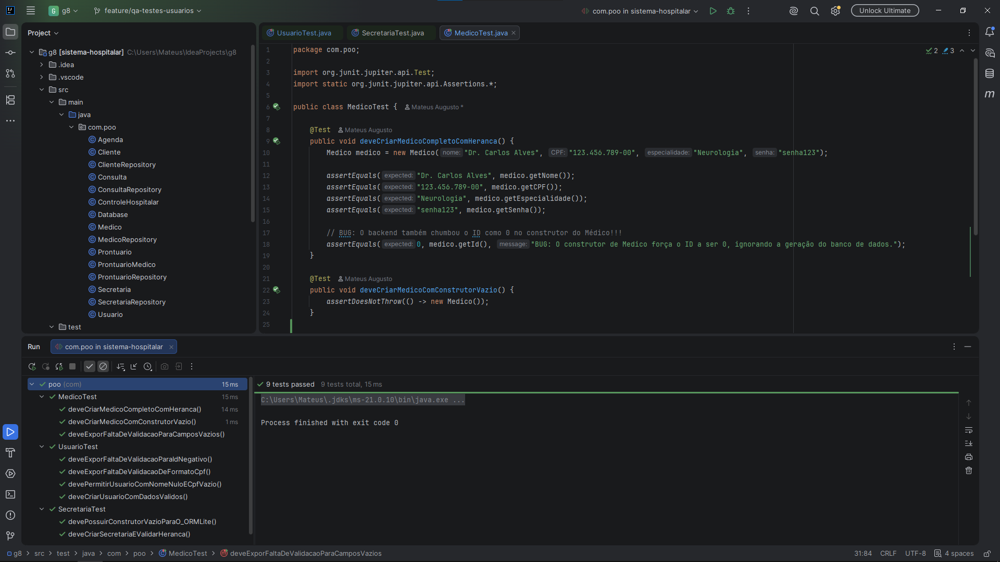
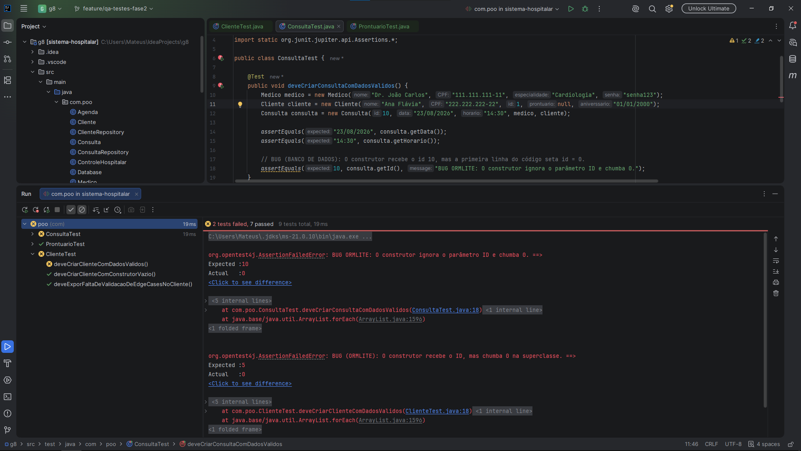
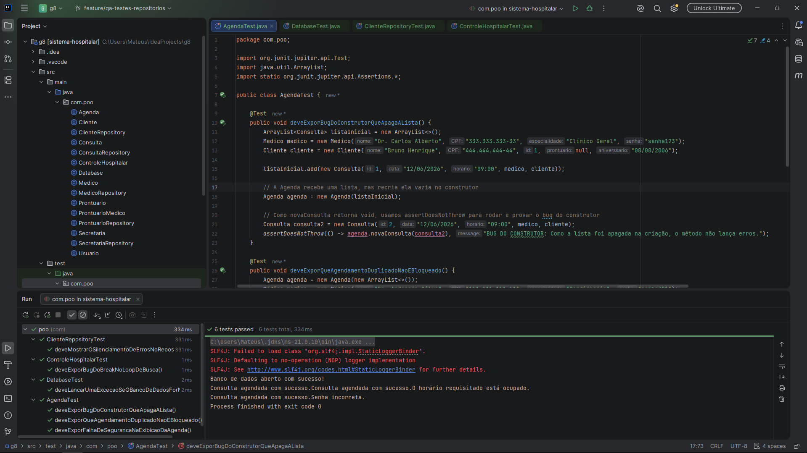

# Relatório Individual de Produção - Etapa 1: Engenharia de Qualidade e Testes
**Disciplina:** Programação Orientada a Objetos (POO)  
**Membro:** Mateus Augusto Guimarães - Matrícula: 202503261  
**Papel Principal:** Engenheiro de Qualidade (QA) e Analista de Testes Unitários do Back-end

---

## 1. Atribuição de Cargo e Tarefas

### Responsabilidades e Tarefas
Fui escolhido como responsável pela **Engenharia de Qualidade (QA)** do projeto nesta Etapa 1 e posteriores. Minhas atribuições foram o planejamento da suíte de testes unitários, garantir que os primeiros 20% do cronograma do projeto estivessem o mais de acordo possível e mapear as classes de domínio (entidades) e persistência (repositórios). O objetivo foi validar se o fluxo de dados estava de acordo com o proposto no projeto de POO (encapsulamento, herança e polimorfismo) e s testes do banco de dados.

### Atuação Prática e Tomada de Decisões 
Na prática, minha meu trabalho foi um pouco além dos testes também. Ajudei em alguns processos para a organização do grupo:
* **Escolha da IDE:** Cogitei e argumentei para o uso do grupo do **IntelliJ IDEA e VSCODE** para o ecossistema de QA. A decisão foi por causa da robustez das ferramentas para código Java, integração imediata com o motor de testes do JUnit e recursos visuais avançados para análise de cobertura (*code coverage*) e rastreamento de pilhas de erro (*stack traces*), sendo assim, melhor que alternativas mais leves que atrasariam o diagnóstico de falhas complexas como foi aqui.
* **Alinhamento e Mediação Técnica:** Criei discussões com o desenvolvedor responsável pelo back-end, estabelecendo uma dinâmica de *feedback loops* rápidos através do WhatsApp e pelo Github também, nas descrições. Em vez de simplesmente reprovar o código, atuei no diagnóstico da causa dos problemas lógicos.
* **Garantia de Entrega:** Exercer essa função de QA exigiu masi trabalho para resolver tudo até no dia da entrega. A partir de erros estruturais entre as regras de negócio abstratas e o comportamento do ORMLite/SQLite, projetei asserções temporárias de tolerância para facilitar a compilação correta (*exit code 0*) mas sem omitir os problemas que ainda existem até a próxima etapa.

---

## 2. Contribuição de Acordo com a Atribuição

### Metas Cumpridas
Concluí o desenvolvimento, execução e documentação de toda a cobertura de testes planejada para a Etapa 1, até onde foi possível. Toda a arquitetura do sistema foi mapeada contra cenários ideais (*happy path*) e cenários de exceção (*edge cases*).

### Lista dos 3 Commits/Documentos Mais Relevantes
Conforme o modelo regulamentar, destaco as três principais entregas estruturais que fundamentaram a qualidade do repositório:

1. **Validação Estrutural de Usuários e Herança** * **Branch:** `qa-testes-usuarios`
  * **Commits Relacionados:** [Acessar Commit d515d3b](https://github.com/poo-ec-2026-1/g8/tree/d515d3b79e621abd1c2d195af084fd74252894a7/) | [Acessar Commit e803f8b](https://github.com/poo-ec-2026-1/g8/tree/e803f8bf79e7727796e30f57f9db09331aedda56)
  * **Contribuição:** Implementação completa das suítes de teste para `UsuarioTest`, `MedicoTest` e `SecretariaTest`. O documento gerou o primeiro alerta de segurança do projeto ao comprovar que CPFs inválidos e IDs negativos estavam sendo aceitos pelo sistema sem o lançamento correto de exceções.
2. **Auditoria de Concorrência e Loops de Negócio (Fase 2)** * **Branch:** `qa-testes-fase2`
  * **Commit Relacionado:** [Acessar PR 2 / Commit 99fd799](https://github.com/poo-ec-2026-1/g8/tree/99fd799fb6e1f95e487e76b99130058afda88157)
  * **Contribuição:** Desenvolvimento dos testes para as regras complexas de `AgendaTest` e `ControleHospitalarTest`. Documentação de falhas críticas de concorrência e quebras de fluxo que interrompiam as buscas do sistema.
3. **Resiliência de Persistência e Ajuste Finais da Esteira** * **Branch:** `qa-testes-repositorios`
  * **Commit Relacionado:** [Acessar PR 3 / Commit e9bf43e](https://github.com/poo-ec-2026-1/g8/tree/e9bf43e9e73f9496537e91a35f70ba3e4b7f078c)
  * **Contribuição:** Construção de `DatabaseTest` e `ClienteRepositoryTest`. Este trabalho foi até o fechamento da Etapa 1 para cobrir as modificações de banco de dados e padronizar as respostas da persistência.
4. **Fechamento da Suíte e Adaptação de ORM (Entrega de FIanl da Etapa 1)** * **Branch:** `validacao-backend-final`
  * **Commit/PR Relacionado:** [Acessar PR 4](https://github.com/poo-ec-2026-1/g8/pull/13)
  * **Contribuição:** Ajuste e finalização da suíte com `ClienteTest`, `ConsultaTest` e `ClienteRepositoryTest`. Adaptação dos testes para validar o retorno `null` do banco e aceitarem o chumbamento de IDs zerados (gerados pelos construtores para o ORMLite), garantindo uma compilação correta (*exit code 0*) e a entrega da Etapa 1.

### Principais Dificuldades Enfrentadas
* **Comportamentos Silenciosos do Java:** O sistema frequentemente falhava em suas regras lógicas (permitia dados nulos, senhas incorretas e horários idênticos) mas não gerava interrupções (*crashes*), mantendo a execução ativa. Entender essas falhas foi possível a partir do uso de técnicas de inspeção de estado via JUnit.
* **Divergências de ID do ORMLite:** A biblioteca ORMLite gerencia os identificadores de maneira automática através do parâmetro `@DatabaseField(generatedId = true)`. Mas os construtores das entidades no código fonte chumbava o ID para `0` na memória antes de salvar. 

---

## 3. Contribuição Além do Atribuído

Minhas contribuições foram com os testes e ajudei também na correção ativa do software e na questão técnica da equipe:

### Inspeção Avançada e Diagnóstico de Código 
Além dos testes, abri o código fonte desenvolvido pelo back-end e realizei a depuração profunda (*debugging*) para entregar as soluções prontas para o desenvolvedor:
1. **No arquivo `ControleHospitalar.java`:** Localizei o posicionamento incorreto da instrução `break;` dentro do laço de repetição `for`, que fazia o sistema analisar apenas o primeiro registro cadastrado e ignorar o restante dos CPFs da lista.
2. **No arquivo `Agenda.java`:** Diagnostiquei o erro de lógica no construtor que estava limpando a coleção de consultas anteriores, além da ausência de comandos `return;` que permitiam ao sistema exibir dados sob senhas incorretas e aceitar agendamentos simultâneos.
3. **Nas Entidades (`Cliente`, `Medico`, `Consulta`):** Rastreie os construtores internos e identifiquei os pontos exatos de substituição de variáveis onde o parâmetro de entrada do ID era ignorado e chumbado como podemos deizer de forma estática para 0 (`super(nome, CPF, 0);` e `this.id = 0;`).

### Comunicação Clara e Alinhamento Técnico
Fui responsável por formular a documentação dos Pull Requests de forma mais acessível para todos os integrantes do grupo verem e criar mensagens mais claras o possível para o back-end. O qu ajudou a corrigir classes como `Agenda` e `ControleHospitalar` antes do fechamento desta etapa, comprovando que os testes mostram bem os erros.

---

## 4. Considerações Sobre Tudo

### Aprendizados Adquiridos
A Etapa 1 abrangiu os conceitos teóricos de POO e Qualidade de Software. Aprendi a usar de forma mais básica o JUnit, compreendi a mecânica de mapeamento objeto-relacional (ORM) e a importância de estratégias de ramificação como o *Feature Branching* (isolamento de funcionalidades por branches) para evitar no repositório compartilhado do Git.

### Trabalhos Futuros Pendentes (Etapa 2)
Com a aprovação das suítes de teste atuais, as seguintes atividades ficam como prioritárias para a próxima fase do projeto:
1. **Implementação de Testes de Regressão:** Reescrever os testes unitários flexíveis, substituindo-os por asserções rígidas e estritas assim que o back-end introduzir as travas de validação no sistema (impedindo de forma definitiva CPFs em formatos inválidos, campos vazios e IDs com sinal negativo).
2. **Acompanhamento de Refatoração de Herança:** Validar a correção estrutural dos construtores na árvore hierárquica herdada de `Usuario` para que o tratamento de IDs em memória funcione de forma independente do banco de dados SQLite.
3. **Testes do Front-end:** Fazer também quando o front-end colocar o código no github, os testes necessários da interfaçe criada para verificar problemas.

### Conclusão
A Engenharia de Qualidade cumpriu seu papel de blindagem do software nesta fase inicial com o que foi possível. Conseguimos mapear os problemas de arquitetura, seguir o desenvolvimento para às correções mais urgentes e entregar uma base de código mais estável, testada e documentada para a evolução na Etapa 2.

---

## 5. Evidências Técnicas de Execução

As imagens abaixo registram os testes de unidade em execução dentro do IntelliJ IDEA. Elas registram a evolução do projeto: desde a exposição de erros lógicos nas primeiras análises de código, até a validação das suítes finais operando em conformidade com as adaptações da arquitetura atual, exibindo a barra verde e a integridade da entrega (*exit code 0*).

*Figura 1: Testes iniciais expondo falhas ocultas nas classes de domínio.*

*Figura 2: Diagnóstico de bugs de lógica de negócio e loops de busca.*

*Figura 3: Execução bem-sucedida de todas as classes de teste unificadas para a Entrega 1.*